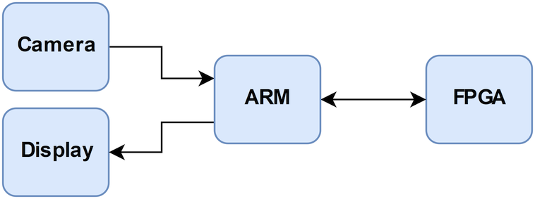
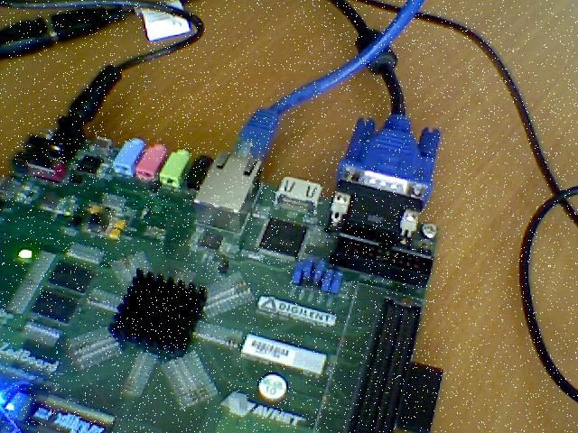
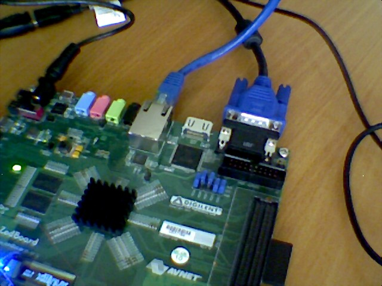

# Zynq FPGA - Median Filter

Purpose of the project was to connect webcam to  [ZedBoard](http://zedboard.org/product/zedboard), filter received image with simple 3x3 [median filter](https://en.wikipedia.org/wiki/Median_filter) and show results on display.

ZedBoard is a development kit featuring [Zynq-7000 All Programmable SoC XC7Z020-CLG484-1](http://www.xilinx.com/products/silicon-devices/soc/zynq-7000.html). It contains both ARM Cortex-A9 and Artix-7 FPGA inside one chip.  
[Xillinux](http://xillybus.com/xillinux) is running on ARM which is Linux distribution dedicated for this board. It already has interfaces for communication with FPGA in the form of FIFOs in /dev directory.  
FPGA can be easily programmed without knowing VHDL, Verilog or any other HDL. There is a tool called [Vivado HLS](https://www.xilinx.com/products/design-tools/vivado/integration/esl-design.html) which transforms program written in C to HDL and later synthesizes it to FPGA configuration.

  
Median filter is a digital filter often used in digital image processing for noise removal.

## Implementation

This implementation uses version of median filter where each of RGB channel is median filtered separately.

For receiving image from webcam and displaying filtered result I used ARM side of Zynq SoC. Camera was connected to the board by USB and display by VGA. Xillinux automatically recognized both devices.  
To read frames from webcam I used [OpenCV](http://opencv.org/) library. Also I used it for splitting images to separate RGB channels before sending them to FPGA and for adding some artificial noise to image because original frames from webcam were too clear to see results of the filter.  
Color channels were being sent to FPGA and simultaneously processed ones were being received. Those received channels were being assemblied back to entire frames also with help of OpenCV and finally displayed on the screen.  
All of this was done by [this](Xillinux/main.cpp) program.

On FPGA there was a simple [implementation](FPGA/main.c) of median filter which receives each row of pixels and using three of them generates row of filtered pixels.

## Result

|  |  |
| :------------------------------------------: |:---------------------------------------:|
| Original (artificially noised) | Filtered |
